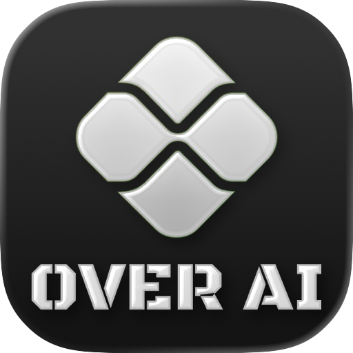

<p align="center">
  
</p>

<h1 align="center">OverAI</h1>
<p align="center"><strong>The Seamless AI Bridge for macOS</strong></p>

<p align="center">
  <a href="#features">Features</a> •
  <a href="#installation">Download</a> •
  <a href="#privacy">Privacy</a> •
  <a href="#development">Development</a>
</p>

<p align="center">
  
  
  <a href="https://github.com/Jaysingh2003/Mac_Ai/releases/download/v2.0.0/OverAI-Installer.dmg"></a>
  
</p>

---

**OverAI** transforms your Mac into an intelligent workspace. Access ChatGPT, Claude, Gemini, or your own completely offline Local LLMs instantly with a single keystroke. 

Floating gracefully above your workflow, it feels like a native part of macOS—appearing exactly when you need it, and disappearing when you don't.

---

## ✨ Features

### ⚡️ Instant Intelligence
Toggle your assistant with **`Command + G`** from anywhere. Switching tabs breaks flow; OverAI keeps you in the zone.

### 🧠 Model Agnostic
Why choose? Use the best model for the task.
- **Cloud Powerhouses**: ChatGPT, Claude, Gemini, Perplexity, DeepSeek, Grok.
- **Local Privacy**: Native integration with [Ollama](https://ollama.ai) for completely offline AI (Llama 3, Mistral, etc.).

### 🎨 Native Experience
- **Apple Design**: Built with AppKit and SwiftUI principles. Matches your system theme perfectly.
- **Glassmorphism**: Beautiful translucent UI that blends into your desktop.
- **Interactive**: Swipe to adjust window transparency instantly.
- **iMessage-Style Chat**: A familiar, clean interface for local conversations.

### 🛡️ Secure & Lightweight
- **Privacy First**: Your chats are your own. OverAI stores nothing on intermediate servers.
- **Resource Efficient**: Uses minimal RAM (~50MB idle) and auto-sleeps to preserve battery life.
- **Sandboxed**: No access to your private files.

---

## 📥 Installation

### Option 1: DMG Installer (Recommended)
1. **[Download OverAI-Installer.dmg](https://github.com/Jaysingh2003/Mac_Ai/releases/download/v2.0.0/OverAI-Installer.dmg)** (v2.0.0)
2. Drag **OverAI** to your **Applications** folder.
3. Open it via Spotlight (`Cmd + Space` -> OverAI).

### Option 2: Run from Source
Perfect for developers who want to customize the code.

```bash
# Clone the repository
git clone https://github.com/Jaysingh2003/Mac_Ai.git
cd Mac_Ai

# Setup environment
python3 -m venv .venv
source .venv/bin/activate
pip install -r requirements.txt

# Launch
python -m overai
```

---

## ⌨️ Shortcuts

| Shortcut | Action |
|----------|--------|
| **⌘ + G** | Toggle Window (Global) |
| **⌘ + H** | Hide Window |
| **⌘ + R** | Reload Service |
| **⌘ + ,** | Preferences |
| **⌘ + Q** | Quit OverAI |

---

## 🔒 Privacy

OverAI is designed with a strict **Local-First** philosophy:

1. **Direct Connections**: Web services (ChatGPT, etc.) are loaded directly in a secure WebView. No middleman API servers.
2. **Local AI**: When using Ollama, data never leaves your machine. Perfect for sensitive documents or code.
3. **No Tracking**: We do not track your usage, prompts, or personal data.

---

## 🛠️ Development

Built with **Python 3** and **PyObjC**, leveraging native macOS frameworks (AppKit, WebKit, AVFoundation) for maximum performance without the bloat of Electron.

### Building for Release
```bash
# Generate standalone .app and .dmg
python setup.py py2app
./create_dmg.sh
```

---

<p align="center">
  <strong>Open Source. MIT License.</strong><br>
  Made with ❤️ by Jay Singh
</p>
